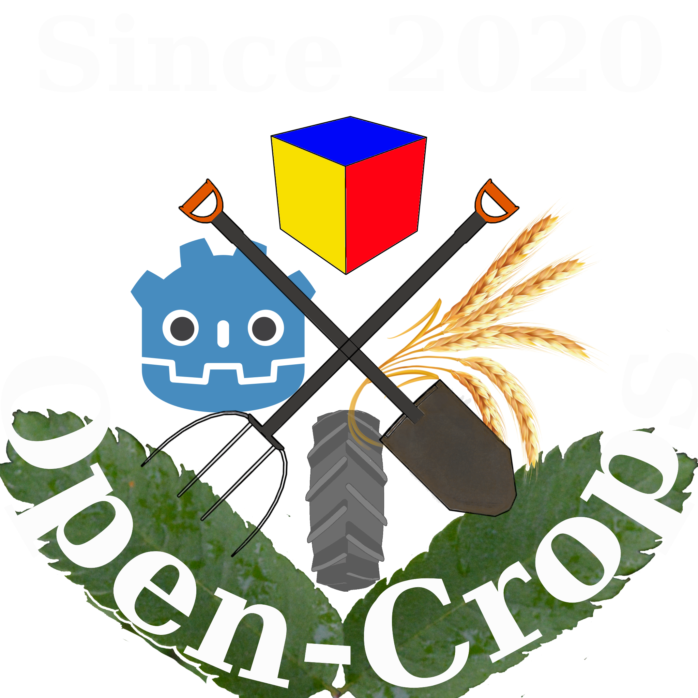

<header>
    
    <h1>Open-Crops</h1>
    
This is the repository used for prototypes as well as developing experimental solutions.

   </header>

<link>
 <h3>If you are looking for the main repository, you can find it here</h3><a href="https://github.com/EramarkMedia/Open-Crops/">Open-Crops</a> 
</link>

<list>
  <ul>
  <li>Coffee</li>
  <li>Tea</li>
  <li>Milk</li>
</ul> 
</list>

<contributions>
    <h3>Contributions Are Welcome</h3>
</contributions>
